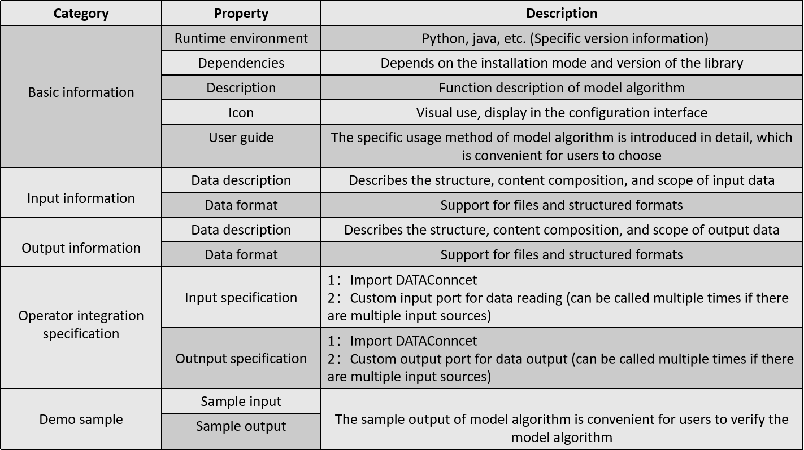

## Python component development specification



## How to develop a python component?

> *  Import DATAConncet from data_connect.py
> ```
> from data_connect import DATAConncet
> ```
> * Custom input port for data reading (can be called multiple times if there are multiple input sources);
> * Custom output port for data output (can be called multiple times if there are multiple output sources);
> * Customize the properties. If the model requires parameter input, you need to customize the algorithm attributes;
> * Package the python component into a zip package (the zip package must contain the model algorithm and its required dependencies (requirements.txt)).
