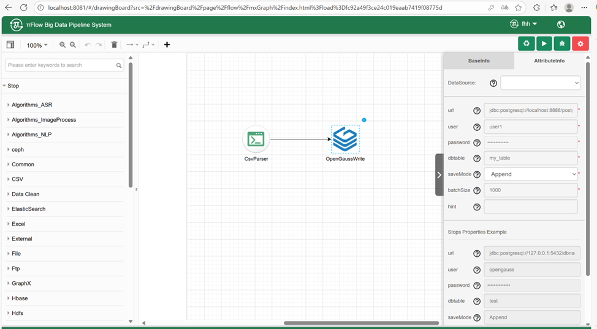
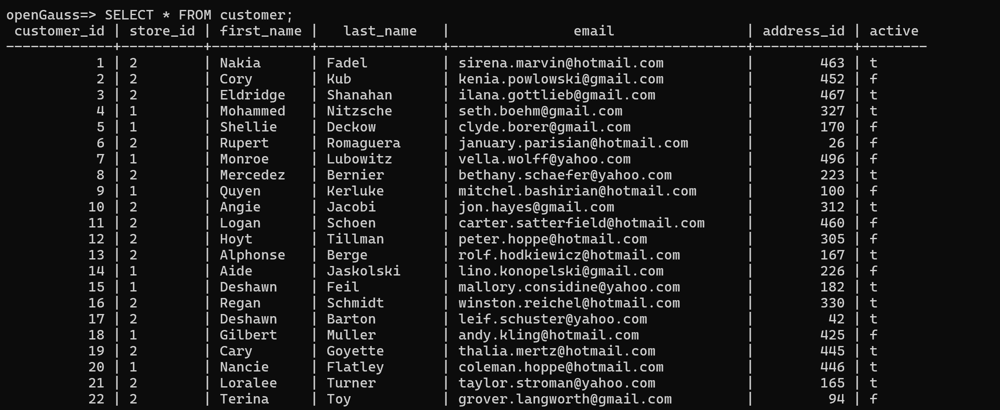

# <center>国产数据库读写组件使用说明书


### 1.组件介绍

​		openGauss 和 KingbaseES（金仓）作为两款主流的国产数据库管理系统，凭借其高性能、高可用性和安全性，在政府、金融、能源等多个关键行业得到了广泛应用。为了提升πFlow平台的数据源兼容性，并推动数据处理流程的国产化转型，有必要开发针对openGauss和 KingbaseES（金仓）数据库的读写组件，实现高效的双向数据交互。

**组件：**

* openGauss数据库读取组件：负责从openGauss数据库中读取数据，并将数据加载到Spark DataFrame中，为后续的大数据处理提供基础支持。
* openGauss数据库存储组件：负责将上游组件处理后的DataFrame结果存储回openGauss数据库，支持多种存储模式（如插入、更新、批量写入等），以满足不同场景的需求。
* KingbaseES数据库读取组件：负责从KingbaseES数据库中读取数据，并将其加载到Spark DataFrame中，为后续的大数据处理提供基础支持。
* KingbaseES数据库存储组件：负责将上游组件处理后的DataFrame结果存储回KingbaseES数据库，支持多种存储模式（如插入、更新、批量写入等），以满足不同场景的需求。
* 

### 2.环境要求

示例时使用的数据库版本：

* openGauss镜像：opengauss/opengauss-server:latest
* KingbaseES镜像：kingbase_v009r001c010b0004_single_x86:v1

额外加入的pom依赖：

```xml
<dependency>
    <groupId>cn.com.kingbase</groupId>
    <artifactId>kingbase8</artifactId>
    <version>9.0.0</version>
</dependency>
```


### 3.参数说明

#### openGauss读取组件

openGauss读取组件的配置参数如下所示：


| **参数名称**    | **格式**                                   | **作用**                                                     |
| --------------- | ------------------------------------------ | ------------------------------------------------------------ |
| url             | jdbc:postgre://<HOST-NAME>:<PORT>/<DBNAME> | 表示要连接的 openGauss 数据库的链接地址                      |
| user            | String                                     | 连接到该数据库的用户名                                       |
| password        | String                                     | 连接到该数据库的密码                                         |
| tableName       | String                                     | 表示需要读取数据的表名                                       |
| selectedContent | String                                     | 表示需要读取的列名，若需读取所有列则填入“*”                  |
| queryDop        | Integer                                    | 表示子查询的数目。openGauss 在执行查询时会设置 queryDop 个 worker 并发执行查询。 |
| hint            | String                                     | 用户可以通过该参数干预 SQL 语句的优化，以实现更高效的查询效果。多个hint采用空格分隔。 |

#### openGauss写入组件

openGauss写入组件的配置参数如下所示：



| **参数名称** | **格式**                                   | **作用**                                                     |
| ------------ | ------------------------------------------ | ------------------------------------------------------------ |
| url          | jdbc:postgre://<HOST-NAME>:<PORT>/<DBNAME> | 表示要连接的 openGauss 数据库的链接地址                      |
| user         | String                                     | 连接到该数据库的用户名                                       |
| password     | String                                     | 连接到该数据库的密码                                         |
| dttable      | String                                     | 表示需要读取数据的表名                                       |
| saveMode     | Enum                                       | 存储模式，分别为Append、OverWrite和Ignore                    |
| batchSize    | Integer                                    | 表示批次的提交数目，每隔batchSize条记录进行依次提交。        |
| hint         | String                                     | 用户可以通过该参数干预 SQL 语句的优化，以实现更高效的查询效果。多个hint采用空格分隔。 |


#### KingbaseES读取组件

KingbaseES读取组件的配置参数如下所示：


| **参数名称**    | **格式**                                     | **作用**                                                     |
| --------------- | -------------------------------------------- | ------------------------------------------------------------ |
| url             | jdbc:kingbase8://<HOST-NAME>:<PORT>/<DBNAME> | 表示要连接的KingbaseES数据库的链接地址                       |
| user            | String                                       | 连接到该数据库的用户名                                       |
| password        | String                                       | 连接到该数据库的密码                                         |
| tableName       | String                                       | 表示需要读取数据的表名                                       |
| selectedContent | String                                       | 表示需要读取的列名，若需读取所有列则填入“*”                  |
| hint            | String                                       | 用户可以通过该参数干预 SQL 语句的优化，以实现更高效的查询效果。多个hint采用空格分隔。 |

#### KingbaseES写入组件

KingbaseES写入组件的配置参数如下所示：


| **参数名称** | **格式**                                     | **作用**                                                     |
| ------------ | -------------------------------------------- | ------------------------------------------------------------ |
| url          | jdbc:kingbase8://<HOST-NAME>:<PORT>/<DBNAME> | 表示要连接的 KingbaseES数据库的链接地址                      |
| user         | String                                       | 连接到该数据库的用户名                                       |
| password     | String                                       | 连接到该数据库的密码                                         |
| dttable      | String                                       | 表示需要读取数据的表名                                       |
| saveMode     | Enum                                         | 存储模式，分别为Append、OverWrite和Ignore                    |
| batchSize    | Integer                                      | 表示批次的提交数目，每隔batchSize条记录进行依次提交。        |
| hint         | String                                       | 用户可以通过该参数干预 SQL 语句的优化，以实现更高效的查询效果。多个hint采用空格分隔。 |


### 4. 样例使用

#### 准备工作

在HDFS中创建数据目录：

```
hadoop dfs -mkdir /data
```

将customers.csv表格存储在HDFS中：

```
hadoop dfs -put customers.csv /data
```

创建openGauss的customer表：

```sql
CREATE TABLE customer (customer_id SMALLINT NOT NULL, store_id TINYINT NOT NULL, first_name VARCHAR(45) NOT NULL, last_name VARCHAR(45) NOT NULL, email VARCHAR(50), address_id SMALLINT NOT NULL, active BOOLEAN NOT NULL DEFAULT TRUE, PRIMARY KEY (customer_id));
```

创建KingbaseES的customer表：

```
CREATE TABLE customer (customer_id SMALLINT NOT NULL, store_id SMALLINT NOT NULL, first_name VARCHAR(45) NOT NULL, last_name VARCHAR(45) NOT NULL, email VARCHAR(50), address_id SMALLINT NOT NULL, active BOOLEAN NOT NULL DEFAULT TRUE, PRIMARY KEY (customer_id));
```

#### openGauss写入组件

json数据在piflow-bundle/src/main/resources/flow/jdbc/OpenGaussWrite.json下。

修改CsvParser的csvPath为自己的hadoop地址，OpenGaussWrite的url、用户名和密码为自己的数据库配置，在前端创建对应的工作流：


最终成功写入数据：




#### openGauss读取组件

在运行openGauss写入组件，数据已经被写入openGauss的customer表中。

Json数据在piflow-bundle/src/main/resources/flow/jdbc/OpenGaussRead.json下。

修改OpenGaussRead的url、用户名和密码为自己的数据库配置，修改CSVSave的csvSavePath为自己的数据存储地址。


最终成功读取：


#### KingbaseES写入组件

json数据在piflow-bundle/src/main/resources/flow/jdbc/KingbaseESWrite.json下。

修改CsvParser的csvPath为自己的hadoop地址，KingbaseESWrite的url、用户名和密码为自己的数据库配置，在前端创建对应的工作流：


最终成功写入：


#### KingbaseES读取组件

在运行KingbaseES写入组件，数据已经被写入KingbaseES的customer表中。

Json数据在piflow-bundle/src/main/resources/flow/jdbc/KingbaseESRead.json下。

修改KingbaseESRead的url、用户名和密码为自己的数据库配置，修改CSVSave的csvSavePath为自己的数据存储地址。


最终成功读取：


### 5.注意事项

1. 在连接openGauss或者KingbaseES前，请确定openGauss与KingbaseES已顺利启动实例。
2. Spark需要在Yarn模式下运行，否则通过前端启动工作流，无法及时获取工作流的状态，导致工作流无法正常显示结果。
3. 注意表格的字段类型设置，工作流中的部分操作可能会改变数据类型（例如filter整数字段后，会将数据类型转化为字符串），导致数据无法写入。
4. 如果出现因为版本而无法正常连接数据库的问题，可以修改piflow-bundle/pom.xml中的依赖包版本号。