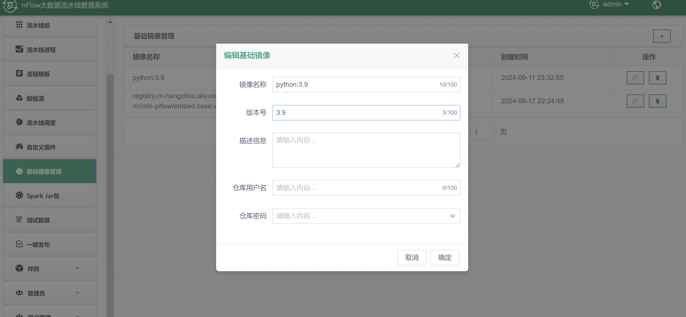

# 
Pinecone向量数据库存储组件使用说明书

### 1.组件介绍

​		该组件是一个用于将文本数据向量化并存储到 Pinecone 向量数据库 中的工具。它利用 Hugging Face 的嵌入模型，将来自PdfParser 、 ImageParser 等解析器⽣成的非结构化文本数据转换为高维向量，并通过 Pinecone 的索引功能进行管理和高效检索。组件的设计支持灵活的配置和扩展，允许用户根据不同的需求调整模型、索引、度量标准等参数，适用于各种基于向量的文本检索和存储场景。

**组件功能：**

1. **文本向量化**：通过 Hugging Face 的预训练模型（如 MiniLM、RoBERTa 等）将文本转化为固定维度的向量表示，支持多种嵌入模型。
2. **向量存储与检索**：使用 Pinecone 构建和管理向量索引，支持高效的向量插入、存储和检索
3. **可配置参数**：
   - **API 密钥**：通过 API 密钥连接 Pinecone 服务。
   - **嵌入模型**：允许用户根据需求选择不同的 Hugging Face 嵌入模型。
   - **索引管理**：用户可自定义索引名称、向量维度、度量标准等，未创建的索引会自动创建。
   - **度量标准选择**：支持三种度量方式（欧几里得距离、余弦相似度、点积），根据场景灵活选择。
4. **批量处理**：支持大规模数据的批量向量化和插入，用户可根据数据量和性能需求调整批量大小。

### 2.环境要求

- python版本：3.9或更高版本
- pinecone云数据库：访问pinecone官网，注册账户
- 所需python库：
  - numpy
  - pandas
  - langchain_community
  - langchain_huggingface
  - pinecone-client

### 3.参数说明

可以通过命令行传入多个参数来控制 Pinecone 索引的创建、向量存储及模型选择等行为。以下是每个参数的使用说明：

| 参数名称    | 类型 | 默认值              | 说明                                                         |
| :---------- | ---- | ------------------- | ------------------------------------------------------------ |
| api_key     | str  |                     | Pinecone API 密钥，用于验证和访问 Pinecone 服务              |
| embed_model | str  | all_MiniLM_L6_v2    | 嵌入模型的名称，用于将文本转换为向量                         |
| index_name  | str  | document-embeddings | Pinecone 中的索引名称，用于存储和检索向量                    |
| dimension   | int  | 384                 | 向量的维度，通常与选择的嵌入模型输出的向量维度一致           |
| metric      | str  | cosine              | 向量检索的度量标准，支持的度量标准有 `"euclidean"`（欧几里得距离）、`"cosine"`（余弦相似度）和 `"dotproduct"`（点积） |
| cloud       | str  | aws                 | 指定 Pinecone 所使用的云平台，支持的值有 `"aws"`、`"gcp"`    |
| region      | str  | us-east-1           | 指定 Pinecone 所使用的区域                                   |
| batch_size  | int  |                     | 在将向量插入 Pinecone 时的批处理大小                         |

### 4.支持的向量化模型

在该组件中，嵌入模型的选择和加载是通过 helpers 脚本中的 `embed_change` 函数实现的。具体过程如下：

1. **模型选择**：`embed_change` 函数用于根据外界传入的模型名称来选择相应的 Hugging Face 嵌入模型。该函数会将模型名称映射到具体的模型路径，确保正确加载对应的模型。
2. **模型加载**：根据用户选择的模型名称，组件会调用 `embed_change` 函数，返回对应模型的路径或名称。然后使用 `HuggingFaceEmbeddings` 来加载该模型，用于后续的文本向量化。
3. **文本向量化**：加载完指定的嵌入模型后，组件将文本数据传递给 Hugging Face 模型进行向量化处理，生成高维向量。这些向量可以用于存储或相似性检索。

通过这种方式，`helper` 脚本中的 `embed_change` 函数使组件能够灵活选择和切换不同的嵌入模型，适应不同的任务场景和需求。

​		目前集成了7个模型，支持自定义扩展（源码在helpers.py），具体信息如下表所示。用户可以自行去hugging face 官网下载，也可以用网盘下载（https://pan.quark.cn/s/fc0de5220493），下载后放到/data的目录下。

### 4.使用说明

（1）配置基础镜像：在docker中拉取python3.9镜像，点击基础镜像管理菜单，配置基础镜像python:3.9即可，配置详情如下图所示：

（2）从公开连接下载对应的嵌入模型放到data\testingStuff\models路径下【https://public.ukp.informatik.tu-darmstadt.de/reimers/sentence-transformers/v0.2/】

（3）配置数据库存储组件：从 GitHub 下载包含向量数据库存储组件的 zip ⽂件，然后将zip包上传到系统并挂载（mount）。挂载成功后，选择组件并编辑其基本信息和图标。配置的详细步骤如下图所示：

（4）配置流水线，详情如下图所示：

（5）运行流水线

（6）运行成功以后日志显示：

（7）查看pinecone数据库,可以看到创建了新的索引并且存储了数据

### 5.注意事项

1.需要在pinecone官网先注册账户，从而得到api_key，通过api_key连接数据库

2.免费的账户云空间会有一定的限制，当索引量超多免费容量时便无法添加

3.pinecone-finnal.py组件名文件不可以用pinecone.py命名，因为开头有import pinecone会产生干扰